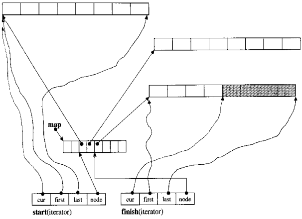
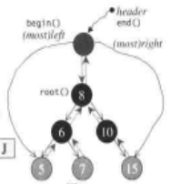
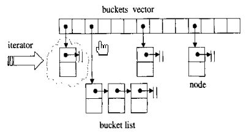
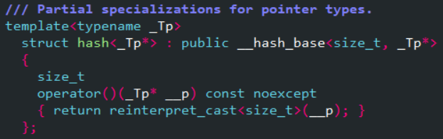

# STL

我用的是gcc的windows版本：mingW32，与STL源码剖析的SGI版本语法习惯稍有不同，但实现算法是一样的。

## 第二章 allocator
### 基本处理工具

STL有5个全局函数。用于构造的`construct()`、用于析构的`destroy()`，以及`uninitialized_copy()`、`uninitialized_fill()`、`uninitialized_fill_n()`。

### uninitialized_copy()

```c++
template<class InputIterator， class ForwardIterator>
ForwardIterator uninitialized_copy(InputIterator first, InputIterator last, ForwardIterator result);
```

可以将内存配置与对象构造分离开。

若[result, result + (last - first)]范围内每个迭代器都指向未初始化区域，则uninitialized_copy()对范围内每个迭代器，调用`construct(&*(result + i - first)), *i)`产生一个i的复制品。

### uninitialized_fill()
```c++
template<class ForwardIterator, class T>
void uninitialized_fill(ForwardIterator first, ForwardIteratorlast, const T& x);
```

若[first, last]范围内每个迭代器都指向未初始化内存，uninitialized_fill()会对范围内每个迭代器，调用`construct(&*i, x)`产生一个x的复制品。

### uninitialized_fill_n()

```c++
template<class ForwardIterator, class Size, class T>
ForwardIterator uninitialized_fill_n(ForwardIterator first, Size n, const T& x);
```

若[first, first + n]范围内每个迭代器都指向未初始化内存，uninitialized_fill_n()会对范围内每个迭代器，调用`construct(&*i, x)`产生一个x的复制品。

## 第三章 迭代器与traits

#### 暂未完成

## 第四章 序列容器

### vector 

#### 定义
```c++
template<typename _Tp, typename _Alloc>
struct _Vector_base{
public:
	typedef typename __gnu_cxx::__alloc_traits<_Alloc>::template
        rebind<_Tp>::other _Tp_alloc_type;
    typedef typename __gnu_cxx::__alloc_traits<_Tp_alloc_type>::pointer
       	pointer;
	typedef _Alloc allocator_type;
	
    /* 真实操作的数据在这里 */
	struct _Vector_impl : public _Tp_alloc_type{ 
		pointer _M_start;
		pointer _M_finish;
		pointer _M_end_of_storage;
	}
	_Vector_base()  : _M_impl() { } //定义了多种构造函数
	
    /* 这里申请内存 */
    pointer 
      _M_allocate(size_t __n)
      {
	typedef __gnu_cxx::__alloc_traits<_Tp_alloc_type> _Tr;
	return __n != 0 ? _Tr::allocate(_M_impl, __n) : pointer();
      }
    
    //...
	
public:
      _Vector_impl _M_impl;
}
```
```c++
template<typename _Tp, typename _Alloc = std::allocator<_Tp> >
class vector : protected _Vector_base<_Tp, _Alloc>{
	typedef typename _Base::_Tp_alloc_type		 _Tp_alloc_type;
	typedef __gnu_cxx::__alloc_traits<_Tp_alloc_type>  _Alloc_traits;
	typedef __gnu_cxx::__normal_iterator<pointer, vector> iterator;
	
	iterator begin() _GLIBCXX_NOEXCEPT //返回迭代器
	  	{ return iterator(this->_M_impl._M_start); }
	void push_back(const value_type& __x){
		if (this->_M_impl._M_finish != this->_M_impl._M_end_of_storage)
	  	{
	    	_Alloc_traits::construct(this->_M_impl, 
	    	                         this->_M_impl._M_finish, __x);
	    	++this->_M_impl._M_finish;
	  	}
	reference operator[](size_type __n) _GLIBCXX_NOEXCEPT
      	{ return *(this->_M_impl._M_start + __n); } //重载了中括号
	
    void
      resize(size_type __new_size)
      {
	if (__new_size > size())
	  _M_default_append(__new_size - size());
	else if (__new_size < size())
	  _M_erase_at_end(this->_M_impl._M_start + __new_size);
      }
        
     //...
	
protected:
      using _Base::_M_allocate;
      using _Base::_M_deallocate;
      using _Base::_M_impl;
      using _Base::_M_get_Tp_allocator;
}
```
#### vector的数据结构

在基类中，定义了_Vector_impl结构体：

```c++
struct _Vector_impl : public _Tp_alloc_type{ //真实操作的数据在这里
	pointer _M_start;          //目前使用空间的头
	pointer _M_finish;         //目前使用空间的尾
	pointer _M_end_of_storage; //目前可用空间的尾
}
```
```c++
template<typename _Tp>
struct _List_node : public __detail::_List_node_base
{	_Tp _M_data;
	template<typename... _Args>
      _List_node(_Args&&... __args){}	//构造
}
```
### list

#### 节点定义 node：

```c++
struct _List_node_base
    {
      _List_node_base* _M_next;
      _List_node_base* _M_prev;

      void
      _M_transfer(_List_node_base* const __first,
    	  _List_node_base* const __last) _GLIBCXX_USE_NOEXCEPT;
      
      void
      _M_reverse() _GLIBCXX_USE_NOEXCEPT;
      ...
    };
```
```c++
template<typename _Tp>
struct _List_node : public __detail::_List_node_base{
	///< User's data.
	_Tp _M_data;
    template<typename... _Args> 
        _List_node(_Args&&... __args){}; //构造
};
```


#### 链表定义 list:

```c++
template<typename _Tp, typename _Alloc>
class _List_base{
protected:
	struct _List_impl : public _Node_alloc_type{
        _List_node<size_t> _M_node; // 节点在这里定义
        _List_impl() : _Node_alloc_type(), _M_node(){ }
        ...    //一些构造函数
    }
    //
	_List_impl _M_impl; //真的链表在这里实现
    
    void // 成员函数举例
      _M_put_node(_List_node<_Tp>* __p) _GLIBCXX_NOEXCEPT
      { _M_impl._Node_alloc_type::deallocate(__p, 1); }
}
```

```c++
template<typename _Tp, typename _Alloc = std::allocator<_Tp> >
class list : protected _List_base<_Tp, _Alloc>
{
	typedef _List_base<_Tp, _Alloc>                    _Base;
	... //此处有很多的typedef
protected:
	typedef _List_node<_Tp>				 _Node;
	using _Base::_M_impl; // 这些是基类的成员函数
    using _Base::_M_put_node;
    using _Base::_M_get_node;
    using _Base::_M_get_Tp_allocator;
    using _Base::_M_get_Node_allocator;
    
public:
    iterator begin() _GLIBCXX_NOEXCEPT
      { return iterator(this->_M_impl._M_node._M_next); }
    
    bool empty() const _GLIBCXX_NOEXCEPT
      { return this->_M_impl._M_node._M_next == &this->_M_impl._M_node; } // 成员函数示例
	
    reference front() _GLIBCXX_NOEXCEPT
      { return *begin(); }
    
    void pop_front() _GLIBCXX_NOEXCEPT
      { this->_M_erase(begin()); }
    ...
}
```

#### list的数据结构

是一个双向链表，核心数据都定义在_List_node中，有：

\_List_node_base* _M_next

_List_node_base* \_M_prev

_Tp _M_data;

### deque

​    vector是单向开口的连续线性空间，deque是双向开口的连续线性空间。双向开口就是可以在头尾两端插入和删除。vector虽然也可以在头部插入删除，但效率太差了。

​    deque和vector最大差异，一是deque可以在常数时间内对两端插入或删除，二是deque没有容量的概念，因为它是动态地以分段连续空间组合而成，不用像vector一样“因为旧空间不足而申请更大空间，再复制进去”。

​     deque虽然也提供random access iterator，但迭代器太复杂。若要排序最好复制进vector排序，再复制回deque。

#### deque迭代器定义

首先定义了`struct _Deque_iterator`，然后重载了`_Deque_iterator`的++、--、[]、==、!= 等等一些运算符。

```c++
template<typename _Tp, typename _Ref, typename _Ptr>
struct _Deque_iterator{
    typedef _Tp* _Elt_pointer;
    typedef _Tp** _Map_pointer;
private:
    typedef _Deque_iterator _Self;
    _Elt_pointer _M_cur;
    _Elt_pointer _M_first;
    _Elt_pointer _M_last;
    _Map_pointer _M_node;
    
    //重载了算数运算符：* -> ++  -- += + -= - []
    _Self& operator++() _GLIBCXX_NOEXCEPT
      {
	++_M_cur;
	if (_M_cur == _M_last) //如果当前迭代器达到这个node的结尾
	  {					   //那么要指向下一个node的开头
	    _M_set_node(_M_node + 1);
	    _M_cur = _M_first;
	  }
	return *this;
      }

    _Self operator++(int) _GLIBCXX_NOEXCEPT
      {
	_Self __tmp = *this;
	++*this;
	return __tmp;
      }
}

//结构体外重载了逻辑运算符，示例如下：
template<typename _Tp, typename _Ref, typename _Ptr>
  inline bool 
  operator>(const _Deque_iterator<_Tp, _Ref, _Ptr>& __x,
	        const _Deque_iterator<_Tp, _Ref, _Ptr>& __y) _GLIBCXX_NOEXCEPT
  { return __y < __x; }
```

#### deque基类定义

```c++
template<typename _Tp, typename _Alloc>
class _Deque_base{
public:
    typedef _Alloc allocator_type;
protected:
    typedef typename iterator::_Map_pointer _Map_pointer;
    struct _Deque_impl : public _Tp_alloc_type{
        _Map_pointer _M_map; // typedef 指向迭代器的 Tp**
		size_t _M_map_size;
		iterator _M_start;
		iterator _M_finish;
    }
    _Deque_impl _M_impl;
    
protected: //这里是关键函数
      void _M_initialize_map(size_t);
      void _M_create_nodes(_Map_pointer __nstart, _Map_pointer __nfinish);
      void _M_destroy_nodes(_Map_pointer __nstart,
			    _Map_pointer __nfinish) _GLIBCXX_NOEXCEPT;
      enum { _S_initial_map_size = 8 };
}
```

#### 官方注释

​        定义完_Deque_base后，在正式定义deque之前，有这样一段**注释**，我翻译成中文：

​       “在之前HP/SGI版本的deque中，还有一个额外的模板参数，可以让用户控制node大小。这项扩展其实违反了c++标准，因此现在被移除了。

​      下面是deque<Tp>的内存管理，每个deque有4个元素：

  - Tp**	      _M_map
  - size_t	     _M_map_size
  - iterator     _M_start, _M_finish__

​     map_size至少为8，这里map是一个_M_map_size大小的array，每个元素都是一个指向node的指针。指定类型的Tp就放在node里，Tp越大，node里放的Tp数量就越少。如果Tp特别大，每个node里只有一个Tp。这么做的目的是维持node的大小相对小且稳定，来提高allocator的效率。


​     并不是每个map里的指针都指向node，若deque初始元素很少，只有map中间的指针有效，两端的不使用。随着map的增长，总会出现这种情况：端点的指针也被使用。如果再创建一个新node，只有map使用的一部分会被复制出去。

类的不变数据：
​     每个非退化（nonsingular）迭代器 i 都有以下变量：
	-- i.node 指向map中的每个元素，而不是直接指向node
	-- i.first == *（i.node）看到了，只有map的元素才是指向node的。
	-- i.last == i.first + node_size
	-- i.cur 是一个在 [i.first, i.last) 范围内的指针。

​     Start和Finish总是非退化的迭代器（因为中间的node都是满的）。
​     对于Start来说，[first - cur]之间是未初始化的，因为尚未使用；[cur - last]之间是初始化过的，因为队列头部刚增长到cur。
​     而Finish的 [first - cur] 是初始化过的，[cur - last] 未初始化。



​     内存的配置以及布局都是在_Base类里实现的，迭代器要负责从一个节点跳向下一个节点。所有操作的实现都是通过start和finish两个迭代器来完成的，这样既简单又合理。”

#### deque定义

```c++
template<typename _Tp, typename _Alloc = std::allocator<_Tp> >
class deque : protected _Deque_base<_Tp, _Alloc>{
public:
      typedef _Tp value_type;
protect:
	  using _Base::_M_initialize_map;
      using _Base::_M_create_nodes;
      using _Base::_M_destroy_nodes;
      using _Base::_M_allocate_node;
      using _Base::_M_deallocate_node;
      using _Base::_M_allocate_map;
      using _Base::_M_deallocate_map;
      using _Base::_M_get_Tp_allocator;
      using _Base::_M_impl;

public:
    // 重载了[]
    reference
      operator[](size_type __n) _GLIBCXX_NOEXCEPT
      { return this->_M_impl._M_start[difference_type(__n)]; }
    
    // front()
    reference
      front() _GLIBCXX_NOEXCEPT
      { return *begin(); }
    
    // back()
    reference
      back() _GLIBCXX_NOEXCEPT
      {
	iterator __tmp = end();
	--__tmp;
	return *__tmp;
      }
    // push_back()
    
    void
      push_back(const value_type& __x)
      {
	if (this->_M_impl._M_finish._M_cur
	    != this->_M_impl._M_finish._M_last - 1)
	  {
	    _Alloc_traits::construct(this->_M_impl,
	                             this->_M_impl._M_finish._M_cur, __x);
	    ++this->_M_impl._M_finish._M_cur;
	  }
	else
	  _M_push_back_aux(__x);
      }
    
    // pop_back()
    void
      pop_back() _GLIBCXX_NOEXCEPT
      {
	if (this->_M_impl._M_finish._M_cur
	    != this->_M_impl._M_finish._M_first)
	  {
	    --this->_M_impl._M_finish._M_cur;
	    _Alloc_traits::destroy(this->_M_impl,
	                           this->_M_impl._M_finish._M_cur);
	  }
	else
	  _M_pop_back_aux();
      }
}
```


### stack

stack底层使用deque完成工作，只是修改了接口。所以又被称作adapter（配接器）。

```c++
template<class T, class Sequence = deque<T>>
class stack{
protect:
	Sequence c; //底层容器
public:
	typedef typename Sequence::reference reference;
	...
	reference top(){	return c.back();} //只是选一个成员函数举例
	...
}
```
当然也可以用list作为底层容器，声明stack<int,list<int>>即可。 

### queue

queue底层也使用deque，也称为adapter。

### heap

最大堆，是一颗完全二叉树。作为priority queue的助手。底层是array和一组heap算法，传入的参数是两个迭代器first和last。

#### make_heap

```c++
template<class RandomAccessIterator> 
inline void make_heap(RandomAccessIterator first, RandomAccessIterator last){
	__make_heap(first, last, value_type(first), distance_type(first));
}

template<class RandomAccessIterator, class T, class Distance>
void __make_heap(...){
	while(true){
		__adjust_heap(first, parent, len, T(...));
	}
}
```

#### push_heap


新插入的一定放在最下一层，也就是vector.end()处。


#### pop_heap

其实是把根节点放到最后，然后，挑战(first, last-1)


#### sort_heap

每次pop一个最大值，就形成了一个有序数组。

```c++
while(last - first > 1)
	pop_heap(first, last--);
```

### priority_queue

#### 定义

默认使用vector存储数据，用heap中的算法管理数据。

```c++
template<typename _Tp, typename _Sequence = vector<_Tp>,
	   typename _Compare  = less<typename _Sequence::value_type> >
class priority_queue{
protected:
    //  See queue::c for notes on these names.
    _Sequence  c;
    _Compare   comp;
public:
    bool empty() const{ return c.empty(); }
    
    // 先放进_Sequence，再调用上节的push_heap
    void push(const value_type& __x){
		c.push_back(__x);
		std::push_heap(c.begin(), c.end(), comp);
     }
    // 第二个例子，调用pop_heap()
    void pop(){
        __glibcxx_requires_nonempty();
        std::pop_heap(c.begin(), c.end(), comp);
        c.pop_back();
    }
    
    ...
}

```

## 第五章 关联容器

###  平衡二叉树

概念不讲了，放上昨晚上自己写的代码：

#### 平衡因子

递归，方法很笨，复杂度O(n^2)。

```c++
int get_deep_balance(node* r){
    int deep = 0, bf = 0;
    if(r){
      int ldeep = get_deep_balance(r->left);
      int rdeep = get_deep_balance(r->right);
      r->bf = ldeep - rdeep;
      //cout << r->val << " " << r->bf <<endl;
      deep = max(ldeep, rdeep) + 1;
    }
    return deep;
}
```

#### 旋转

不管怎么调整，旋转操作是一样的，只有左旋右旋两个步骤。这里只放左旋的。

这里给个概念：

​        p
​        / \
​     #     R
​           /  \
​         RL   *

改成
​        R
​        / \
​     p     *
​    /  \
​ #     RL


```c++
void rotateL(node* p){
    if(p->right == nullptr)
      return;
	//这俩先存起来，后面不怕丢了
    node* R = p->right;
    node* RL = p->right->left;

    if(p->parent){   //先把R改成爹
      if(p->parent->left == p){
        R->parent = p->parent;
        R->parent->left = R;
      }else{
        R->parent = p->parent;
        R->parent->right = R;
      }
    }else{
      this->root = R;
      R->parent = nullptr;
    }
    
	//原父节点变成R的左子
    p->parent = R;
    R->left = p;
    
	//原父的右子指向RL
    p->right = RL;
    if(RL)
      RL->parent = p;
    return;
};
```

#### 4种调整

只不过调用两种旋转即可实现。

```c++
void LL(node* p){
    rotateR(p);
};

void LR(node* p){
    rotateL(p->left);
    rotateR(p);
};

void RL(node* p){
    rotateR(p->right);
    rotateL(p);
};

void RR(node* p){
    rotateL(p);
};
```

插入：

```c++
void insert(int cha){
    if(this->root->val == -2147483647) //空树根节点是-2147483647
      root->val = cha;

    node* pos = find(cha);
    node* n = new node(cha);

    if(pos->val == cha) //已经存在，就不插入了
      return;
    else{
      n->parent = pos;
      if(cha > pos->val)
        pos->right = n;
      else
        pos->left = n;
    }

    get_deep_balance(this->root); //统计整棵树平衡因子，复杂度O(N^2)
    node* p = n;	
    while(p->parent && abs(p->bf)<=1){
      p = p->parent;
    }	//向上找到最低不平衡的p

    if(abs(p->bf)<=1) //如果已经平衡了，那还是返回吧。
      return;
	
    //程序到了这里肯定是不平衡的，先从n向上到底是哪种情况。
    node* par = n;	//看看par的父节点，是否与p的子节点相等
    while(par->parent != p->left && par->parent != p->right){
      par = par->parent;
    }

    if(p->right && par == p->right->right)
      RR(p);
    else if(p->left && par == p->left->left)
      LL(p);
    else if(p->left && par == p->left->right)
      LR(p);
    else if(p->right && par == p->right->left)
      RL(p);
    return;
}
```

### 红黑树

1. 每个节点都有颜色，红或黑
2. 根节点要是黑色
3. 不能有父子节点都是红色
4. 每条路径上黑色节点数量相等

内容太多了，具体请参照《stl源码解析》。需要注意的是，stl的红黑树在root之上还有一个header。header和root互为parent，header的left指向最小节点，right指向最大节点。



这里插入一些下面可能用到的函数：

```c++
template<typename _Key, typename _Val, typename _KeyOfValue,
           typename _Compare, typename _Alloc = allocator<_Val> >
class _Rb_tree{
    _Link_type
      _M_begin() _GLIBCXX_NOEXCEPT
      { return static_cast<_Link_type>(this->_M_impl._M_header._M_parent); }
    
    // 简化版定义
    template<typename _Key, typename _Val, typename _KeyOfValue,
           typename _Compare, typename _Alloc>
    pair<_Rb_tree<>::_Base_ptr, _Rb_tree<>::_Base_ptr>
    _Rb_tree<_Key, _Val, _KeyOfValue, _Compare, _Alloc>::
    _M_get_insert_unique_pos(const key_type& __k) //真正的函数在这，set中_M_insert_unique调用了这个
    {
      typedef pair<_Base_ptr, _Base_ptr> _Res;
      _Link_type __x = _M_begin();
      _Link_type __y = _M_end();
      bool __comp = true;
      while (__x != 0)
	{
	  __y = __x;
	  __comp = _M_impl._M_key_compare(__k, _S_key(__x));
	  __x = __comp ? _S_left(__x) : _S_right(__x);
	}
      iterator __j = iterator(__y);
      if (__comp)
	{
	  if (__j == begin())
	    return _Res(__x, __y);
	  else
	    --__j;
	}
      if (_M_impl._M_key_compare(_S_key(__j._M_node), __k))
	return _Res(__x, __y);
      return _Res(__j._M_node, 0);
    }
    
    
}

```


### set

#### 定义

其实set的操作rb_tree里都定义过，传参即可。

set的迭代器是一个const类型的rb_tree迭代器，不可以通过迭代器更改数据。

```c++
template<typename _Key, typename _Compare = std::less<_Key>,
	   typename _Alloc = std::allocator<_Key> >
class set{
public:
    typedef _Key     key_type;
    typedef _Key     value_type; 
    //这里可以看到set是把key同时当做键值传进去
    
private:   
    typedef _Rb_tree<key_type, value_type, _Identity<value_type>,
		       key_compare, _Key_alloc_type> _Rep_type;
    _Rep_type _M_t;  // Red-black tree representing set.
    
    std::pair<iterator, bool> //插入函数举例
      insert(value_type&& __x)
      {
	std::pair<typename _Rep_type::iterator, bool> __p =
	  _M_t._M_insert_unique(std::move(__x));
	return std::pair<iterator, bool>(__p.first, __p.second);
      }
    
    ...
}
```

### map

```c++
template <typename _Key, typename _Tp, typename _Compare = std::less<_Key>, typename _Alloc = std::allocator<std::pair<const _Key, _Tp> > >
class map{
public:
    typedef _Key  key_type;
    typedef _Tp  mapped_type;
    typedef std::pair<const _Key, _Tp>  value_type;
    
private:
    typedef _Rb_tree<key_type, value_type, _Select1st<value_type>,
		       key_compare, _Pair_alloc_type> _Rep_type;
    _Rep_type _M_t;

public:
    // 这里是我用的最多的[]运算符
    mapped_type&
      operator[](key_type&& __k)
      {
	// concept requirements
	__glibcxx_function_requires(_DefaultConstructibleConcept<mapped_type>)

	iterator __i = lower_bound(__k);
	// __i->first is greater than or equivalent to __k.
	if (__i == end() || key_comp()(__k, (*__i).first))
	  __i = _M_t._M_emplace_hint_unique(__i, std::piecewise_construct,
					std::forward_as_tuple(std::move(__k)),
					std::tuple<>());
	return (*__i).second;
      }
    // 这里的函数调用栈是：
    // 1. iterator _M_emplace_hint_unique(const_iterator __pos, ...)
    // 		auto __res = _M_get_insert_hint_unique_pos(__pos, ...);
    // 2. _M_get_insert_hint_unique_pos(__pos, ...) 
    //    返回值pair<_Rb_tree<>::_Base_ptr, _Rb_tree<>::_Base_ptr>
    // 3. 再次调用红黑树中的_M_get_insert_unique_pos，寻找位置
    
}
```

### multi_set

multi_set插入操作使用的是rb_tree的`insert_equal()`，而不是`insert_unique()`。

```c++
iterator
insert(const value_type& __x)
{ return _M_t._M_insert_equal(__x); }
```

### multi_map

同multi_set

### hashtable

#### 数据结构



#### 源文件注释：

```c++
   *  @tparam _Value  CopyConstructible type.
   *
   *  @tparam _Key    CopyConstructible type.
   *
   *  @tparam _Alloc  An allocator type
   *  ([lib.allocator.requirements]) whose _Alloc::value_type is
   *  _Value.  As a conforming extension, we allow for
   *  _Alloc::value_type != _Value.
   *
   *  @tparam _ExtractKey  Function object that takes an object of type
   *  _Value and returns a value of type _Key.
   *
   *  @tparam _Equal  Function object that takes two objects of type k
   *  and returns a bool-like value that is true if the two objects
   *  are considered equal.
   *
   *  @tparam _H1  The hash function. A unary function object with
   *  argument type _Key and result type size_t. Return values should
   *  be distributed over the entire range [0, numeric_limits<size_t>:::max()].
   *
   *  @tparam _H2  The range-hashing function (in the terminology of
   *  Tavori and Dreizin).  A binary function object whose argument
   *  types and result type are all size_t.  Given arguments r and N,
   *  the return value is in the range [0, N).
   *
   *  @tparam _Hash  The ranged hash function (Tavori and Dreizin). A
   *  binary function whose argument types are _Key and size_t and
   *  whose result type is size_t.  Given arguments k and N, the
   *  return value is in the range [0, N).  Default: hash(k, N) =
   *  h2(h1(k), N).  If _Hash is anything other than the default, _H1
   *  and _H2 are ignored.
   *
   *  @tparam _RehashPolicy  Policy class with three members, all of
   *  which govern the bucket count. _M_next_bkt(n) returns a bucket
   *  count no smaller than n.  _M_bkt_for_elements(n) returns a
   *  bucket count appropriate for an element count of n.
   *  _M_need_rehash(n_bkt, n_elt, n_ins) determines whether, if the
   *  current bucket count is n_bkt and the current element count is
   *  n_elt, we need to increase the bucket count.  If so, returns
   *  make_pair(true, n), where n is the new bucket count.  If not,
   *  returns make_pair(false, <anything>)
   *
   *  @tparam _Traits  Compile-time class with three boolean
   *  std::integral_constant members:  __cache_hash_code, __constant_iterators,
   *   __unique_keys.
   *                                  
   *  Each _Hashtable data structure has:
   *
   *  - _Bucket[]       _M_buckets
   *  - _Hash_node_base _M_before_begin
   *  - size_type       _M_bucket_count
   *  - size_type       _M_element_count
   *
   *  with _Bucket being _Hash_node* and _Hash_node containing:
   *
   *  - _Hash_node*   _M_next
   *  - Tp            _M_value
   *  - size_t        _M_hash_code if cache_hash_code is true
```

   #### 定义

有点复杂，首先看看_Hashtabled声明。

```c++
  template<typename _Key, typename _Value, typename _Alloc,
	   typename _ExtractKey, typename _Equal,
	   typename _H1, typename _H2, typename _Hash,
	   typename _RehashPolicy, typename _Traits>
class _Hashtable
    : public __detail::_Hashtable_base<_Key, _Value, _ExtractKey, _Equal,
				       _H1, _H2, _Hash, _Traits>,
      public __detail::_Map_base<_Key, _Value, _Alloc, _ExtractKey, _Equal,
				 _H1, _H2, _Hash, _RehashPolicy, _Traits>,
      public __detail::_Insert<_Key, _Value, _Alloc, _ExtractKey, _Equal,
			       _H1, _H2, _Hash, _RehashPolicy, _Traits>,
      public __detail::_Rehash_base<_Key, _Value, _Alloc, _ExtractKey, _Equal,
				    _H1, _H2, _Hash, _RehashPolicy, _Traits>,
      public __detail::_Equality<_Key, _Value, _Alloc, _ExtractKey, _Equal,
				 _H1, _H2, _Hash, _RehashPolicy, _Traits>,
      private __detail::_Hashtable_alloc<
	typename __alloctr_rebind<_Alloc,
	  __detail::_Hash_node<_Value,
			       _Traits::__hash_cached::value> >::__type>
{      ...      }
```

这只是声明部分，继承了6个基类，分别是：

`_Hashtable_base、_Map_base、_Insert、_Rehash_base、_Equality、_Hashtable_alloc`

##### Hashtable如何使用的？

上面的H1、H2、Hash模板参数是真正的哈希函数。请看unordered_map中_Hashtable的用法:

```c++
template<bool _Cache>
    using __umap_traits = __detail::_Hashtable_traits<_Cache, false, true>;

template<typename _Key,
	   typename _Tp,
	   typename _Hash = hash<_Key>,
	   typename _Pred = std::equal_to<_Key>,
	   typename _Alloc = std::allocator<std::pair<const _Key, _Tp> >,
	   typename _Tr = __umap_traits<__cache_default<_Key, _Hash>::value>>
using __umap_hashtable = _Hashtable<_Key, std::pair<const _Key, _Tp>,
                                        _Alloc, __detail::_Select1st,
				        _Pred, _Hash,
				        __detail::_Mod_range_hashing,
				        __detail::_Default_ranged_hash,
				        __detail::_Prime_rehash_policy, _Tr>;

template<class _Key, class _Tp,
	   class _Hash = hash<_Key>,
	   class _Pred = std::equal_to<_Key>,
	   class _Alloc = std::allocator<std::pair<const _Key, _Tp> > >
class unordered_map{
      typedef __umap_hashtable<_Key, _Tp, _Hash, _Pred, _Alloc>  _Hashtable;
      _Hashtable _M_h;
...}
```

模板参数输入和形参是这样对应的：

|   模板形参   |      输入实参       |
| :----------: | :-----------------: |
| __ExtractKey | \_detail::_Select1st |
|    _Equal    | std::equal_to<_Key> |
| _H1 | hash<_Key> |
| _H2 |\_\_detail::_Mod_range_hashing |
| _Hash |\_\_detail::_Default_ranged_hash |
| _RehashPolicy |\_\_detail::_Prime_rehash_policy |
| _Traits |\_\_umap_traits<__cache_default<_Key, _Hash>::value>> |

​        **为方便阅读，如非必要，下面的<_Key, _Value, _Alloc, _ExtractKey, _Equal, _H1, _H2, _Hash, _RehashPolicy, _Traits>，我都用<...>表示。**

##### \_detail::_Select1st

位置在：#include <bits/stl_function.h> // equal_to, _Identity, _Select1st

##### hash<_Key>

在bits\\**functional_hash.h**:



##### _Mod_range_hashing

重载了`()`的结构体

```c++
  /// Default range hashing function: use division to fold a large number
  /// into the range [0, N).
  struct _Mod_range_hashing
  {
    typedef std::size_t first_argument_type;
    typedef std::size_t second_argument_type;
    typedef std::size_t result_type;

    result_type
    operator()(first_argument_type __num,
           second_argument_type __den) const noexcept
    { return __num % __den; }
  };
```

##### _Default_ranged_hash

空的，没有定义，只是一个tag，告诉hashtable自己做这件事。

```c++
  /// Default ranged hash function H.  In principle it should be a
  /// function object composed from objects of type H1 and H2 such that
  /// h(k, N) = h2(h1(k), N), but that would mean making extra copies of
  /// h1 and h2.  So instead we'll just use a tag to tell class template
  /// hashtable to do that composition.
  struct _Default_ranged_hash { };
```

##### _Prime_rehash_policy

质数rehash策略。

```c++
/// Default value for rehash policy.  Bucket size is (usually) the
/// smallest prime that keeps the load factor small enough.
struct _Prime_rehash_policy{
    static const std::size_t _S_growth_factor = 2;
    float		_M_max_load_factor;
    mutable std::size_t	_M_next_resize;
    
    float
    max_load_factor() const noexcept
    { return _M_max_load_factor; }
    
    // Return a bucket size no smaller than n.
    std::size_t
    _M_next_bkt(std::size_t __n) const;
    
    // Return a bucket count appropriate for n elements
    std::size_t
    _M_bkt_for_elements(std::size_t __n) const
    { return __builtin_ceil(__n / (long double)_M_max_load_factor); }
     
    typedef std::size_t _State;
    _M_state() const
    { return _M_next_resize; }
    
    void
    _M_reset(_State __state)
    { _M_next_resize = __state; }
    
    ...
}
```

#### _Hashtable_base

```c++
template<typename _Key, typename _Value,
	   typename _ExtractKey, typename _Equal,
	   typename _H1, typename _H2, typename _Hash, typename _Traits>
struct _Hashtable_base
  : public _Hash_code_base<_Key, _Value, _ExtractKey, _H1, _H2, _Hash,
			   _Traits::__hash_cached::value>,
    private _Hashtable_ebo_helper<0, _Equal>
{      ...      }
```

#### _Map_base

```c++
  /**
   *  Primary class template _Map_base.
   *
   *  If the hashtable has a value type of the form pair<T1, T2> and a
   *  key extraction policy (_ExtractKey) that returns the first part
   *  of the pair, the hashtable gets a mapped_type typedef.  If it
   *  satisfies those criteria and also has unique keys, then it also
   *  gets an operator[].
   */
template<typename _Key, typename _Value, typename _Alloc,
	   typename _ExtractKey, typename _Equal,
	   typename _H1, typename _H2, typename _Hash,
	   typename _RehashPolicy, typename _Traits,
	   bool _Unique_keys = _Traits::__unique_keys::value>
struct _Map_base { };
```

根据是否是unique_key，又特例化了两种。

```c++
/// Partial specialization, __unique_keys set to false.
template<...>
struct _Map_base<_Key, _Pair, _Alloc, _Select1st, _Equal,
		     _H1, _H2, _Hash, _RehashPolicy, _Traits, false>
{
	using mapped_type = typename std::tuple_element<1, _Pair>::type;
};
```

```c++
template<...>
struct _Map_base<_Key, _Pair, _Alloc, _Select1st, _Equal,
		     _H1, _H2, _Hash, _RehashPolicy, _Traits, true>{
private:
      using __hashtable_base = __detail::_Hashtable_base<...>;
      using __hashtable = _Hashtable<...>;
      using __hash_code = typename __hashtable_base::__hash_code;
      using __node_type = typename __hashtable_base::__node_type;

public:
      using key_type = typename __hashtable_base::key_type;
      using iterator = typename __hashtable_base::iterator;
      using mapped_type = typename std::tuple_element<1, _Pair>::type;
      //很长，重载了[]和at()           
      mapped_type& operator[](key_type&& __k);
      mapped_type& at(const key_type& __k);
}
```

#### _Insert

基类：为所有_Hashtables提供insert成员函数

```c++
template<...>
struct _Insert_base
{...}
```

特例化，为不同_Hashtable规则选取不同insert函数。

```c++
template<...,
	   bool _Constant_iterators = _Traits::__constant_iterators::value,
	   bool _Unique_keys = _Traits::__unique_keys::value>
struct _Insert;

// 特例1
template<...>
struct _Insert<..., true, true>
    : public _Insert_base<...>
{ ... }

// 特例2
template<...>
struct _Insert<..., true, false>
    : public _Insert_base<...>
{ ... }

// 特例3
template<...>
struct _Insert<..., false, _Unique_keys>
    : public _Insert_base<...>
{ ... }
```

#### _Rehash_base

当且仅当\_ReshapePolicy是\_Prime_rehash_policy时,为hashtable提供max_load_factor 和 functions and reserve函数。

```c++
  template<typename _Key, typename _Value, typename _Alloc,
	   typename _ExtractKey, typename _Equal,
	   typename _H1, typename _H2, typename _Hash,
	   typename _RehashPolicy, typename _Traits>
    struct _Rehash_base;

  template<typename _Key, typename _Value, typename _Alloc,
	   typename _ExtractKey, typename _Equal,
	   typename _H1, typename _H2, typename _Hash, typename _Traits>
    struct _Rehash_base<_Key, _Value, _Alloc, _ExtractKey, _Equal,
			_H1, _H2, _Hash, _Prime_rehash_policy, _Traits>
	{}
```

#### _Equality

#### _Hashtable_ebo_helper

_Tp不是final，而且为空时，使用EBO。

```c++
template<int _Nm, typename _Tp,
	   bool __use_ebo = !__is_final(_Tp) && __is_empty(_Tp)>
    struct _Hashtable_ebo_helper;

template<int _Nm, typename _Tp>
    struct _Hashtable_ebo_helper<_Nm, _Tp, true>
    : private _Tp
    {
      static _Tp& //返回一个Tp的引用
      _S_get(_Hashtable_ebo_helper& __eboh)
      { return static_cast<_Tp&>(__eboh); }
    };

template<int _Nm, typename _Tp>
    struct _Hashtable_ebo_helper<_Nm, _Tp, false>
    {
      static _Tp&
      _S_get(_Hashtable_ebo_helper& __eboh)
      { return __eboh._M_tp; }

    private:
      _Tp _M_tp;
    };
```

#### _Hash_code_base

放官方注释：

```c++
  /**
   *  Primary class template _Hash_code_base.
   *
   *  Encapsulates two policy issues that aren't quite orthogonal.
   *   (1) the difference between using a ranged hash function and using
   *       the combination of a hash function and a range-hashing function.
   *       In the former case we don't have such things as hash codes, so
   *       we have a dummy type as placeholder.
   *   (2) Whether or not we cache hash codes.  Caching hash codes is
   *       meaningless if we have a ranged hash function.
   *
   *  We also put the key extraction objects here, for convenience.
   *  Each specialization derives from one or more of the template
   *  parameters to benefit from Ebo. This is important as this type
   *  is inherited in some cases by the _Local_iterator_base type used
   *  to implement local_iterator and const_local_iterator. As with
   *  any iterator type we prefer to make it as small as possible.
   *
   *  Primary template is unused except as a hook for specializations.
   */
```
基类：


```c++
  template<typename _Key, typename _Value, typename _ExtractKey,
	   typename _H1, typename _H2, typename _Hash,
	   bool __cache_hash_code>
    struct _Hash_code_base;
```
hash参数不是_Default_ranged_hash：
```c++
  /// Specialization: ranged hash function, no caching hash codes.  H1
  /// and H2 are provided but ignored.  We define a dummy hash code type.
  template<typename _Key, typename _Value, typename _ExtractKey,
	   typename _H1, typename _H2, typename _Hash>
    struct _Hash_code_base<_Key, _Value, _ExtractKey, _H1, _H2, _Hash, false>
    : private _Hashtable_ebo_helper<0, _ExtractKey>,
      private _Hashtable_ebo_helper<1, _Hash>
  {}
```

```c++
  /// Specialization: ranged hash function, cache hash codes.  This
  /// combination is meaningless, so we provide only a declaration
  /// and no definition.
  template<typename _Key, typename _Value, typename _ExtractKey,
	   typename _H1, typename _H2, typename _Hash>
    struct _Hash_code_base<_Key, _Value, _ExtractKey, _H1, _H2, _Hash, true>;
```

hash参数是_Default_ranged_hash：

```c++
  /// Specialization: hash function and range-hashing function, no
  /// caching of hash codes.
  /// Provides typedef and accessor required by C++ 11.
  template<typename _Key, typename _Value, typename _ExtractKey,
	   typename _H1, typename _H2>
    struct _Hash_code_base<_Key, _Value, _ExtractKey, _H1, _H2,
			   _Default_ranged_hash, false>
    : private _Hashtable_ebo_helper<0, _ExtractKey>,
      private _Hashtable_ebo_helper<1, _H1>,
      private _Hashtable_ebo_helper<2, _H2>
      {}
```

```c++
  /// Specialization: hash function and range-hashing function,
  /// caching hash codes.  H is provided but ignored.  Provides
  /// typedef and accessor required by C++ 11.
  template<typename _Key, typename _Value, typename _ExtractKey,
	   typename _H1, typename _H2>
struct _Hash_code_base<_Key, _Value, _ExtractKey, _H1, _H2,
			   _Default_ranged_hash, true>
    : private _Hashtable_ebo_helper<0, _ExtractKey>,
      private _Hashtable_ebo_helper<1, _H1>,
      private _Hashtable_ebo_helper<2, _H2>
{
private:
	using __ebo_extract_key = _Hashtable_ebo_helper<0, _ExtractKey>;
	using __ebo_h1 = _Hashtable_ebo_helper<1, _H1>;
	using __ebo_h2 = _Hashtable_ebo_helper<2, _H2>;
public:
      typedef _H1 					hasher;

      hasher
      hash_function() const
      { return _M_h1(); }
          
protected:
      typedef std::size_t 				__hash_code;
      typedef _Hash_node<_Value, true>			__node_type;
          
      __hash_code	//这个会经常用到，查找一个k对应的hash_code
      _M_hash_code(const _Key& __k) const
      { return _M_h1()(__k); }
          
      _H1&	//调用的其实是这个函数，再调用上面ebo_helper的_S_get
      _M_h1() { return __ebo_h1::_S_get(*this); }
          
      _H2&
      _M_h2() { return __ebo_h2::_S_get(*this); }
      
      _ExtractKey&
      _M_extract() { return __ebo_extract_key::_S_get(*this); }
          
      // 存储和复制hash_code，每个节点都有hash_code   
      void
      _M_store_code(__node_type* __n, __hash_code __c) const
      { __n->_M_hash_code = __c; }

      void
      _M_copy_code(__node_type* __to, const __node_type* __from) const
      { __to->_M_hash_code = __from->_M_hash_code; }

}
```

### unordered_map

要用到的接口，hashtable几乎都提供了，所以基本上就是包装一个接口就行了。

```c++
template<class _Key, class _Tp,
	   class _Hash = hash<_Key>,
	   class _Pred = std::equal_to<_Key>,
	   class _Alloc = std::allocator<std::pair<const _Key, _Tp> > >
class unordered_map
{
public:
	typedef __umap_hashtable<_Key, _Tp, _Hash, _Pred, _Alloc>  _Hashtable;
	_Hashtable _M_h;
    
    bool
      empty() const noexcept
      { return _M_h.empty(); }
    
	template<typename _InputIterator>
	void insert(_InputIterator __first, _InputIterator __last)
		{ _M_h.insert(__first, __last); }
    
    iterator
      begin() noexcept
      { return _M_h.begin(); }

    template<typename... _Args>
	std::pair<iterator, bool>
	emplace(_Args&&... __args)
	{ return _M_h.emplace(std::forward<_Args>(__args)...); }
    
    size_type
      count(const key_type& __x) const
      { return _M_h.count(__x); }
    
    std::pair<iterator, iterator>
      equal_range(const key_type& __x)
      { return _M_h.equal_range(__x); }
    
    mapped_type&
      operator[](const key_type& __k)
      { return _M_h[__k]; }
    
    ...
}
    
```

### unordered_set

同上。

```c++
  template<class _Value,
	   class _Hash = hash<_Value>,
	   class _Pred = std::equal_to<_Value>,
	   class _Alloc = std::allocator<_Value> >
    class unordered_set
    {
      typedef __uset_hashtable<_Value, _Hash, _Pred, _Alloc>  _Hashtable;
      _Hashtable _M_h;
    }
```


## 参考资料

1. https://www.cnblogs.com/St-Lovaer/p/11616655.html
2. http://gcc.gnu.org/onlinedocs/gcc-4.8.2/libstdc%2B%2B/api/a00427.html