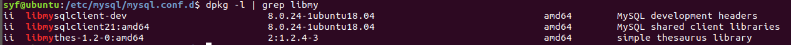
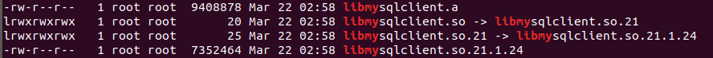

### 1. 安装

#### 1.1 mysql

**使用系统：** ubuntu18.04 64位

由于网上教程中，直接使用apt-get安装的已经不是最新版本的sql，所以按照

https://zazalu.space/2019/06/14/ubuntu18-04%E5%AE%89%E8%A3%85mysql8-0-16-Community/

教程进行安装。

安装过程中会出现`package configuration`界面，按下esc，再选择一种加密方式即可。

安装完成可以输入`sudo service mysql status`查看状态。

#### 1.2 连接工具

有两种，**libmysqlclient-dev(C API)**和**connector/c++ **。

##### (1) libmysqlclient-dev(C API)

用纯C实现，以libmysqlclient库名发布。ubuntu的apt-get可以下载最新版：

`sudo apt-get install libmysqlclient-dev`

`dpkg -l | grep libmy`看装了什么版本的libmysqlclient-dev（C api）



`dpkg -c *.deb`可以看会安装哪些文件（头文件和链接文件等），在什么路径。

**文件安装路径：**

头文件：/usr/include/mysql

链接库文件：/usr/lib/x86_64-linux-gnu



<center>C API链接库</center>

##### (2) Connector/C++ 

connector/c++ 有1.1和8.0两个版本，官方推荐升级到8.0。其中实现了三种api：

- [X DevAPI](https://dev.mysql.com/doc/dev/connector-cpp/8.0/devapi_ref.html)

- [X DevAPI for C](https://dev.mysql.com/doc/dev/connector-cpp/8.0/xapi_ref.html)

- [JDBC4-based API](https://dev.mysql.com/doc/dev/connector-cpp/8.0/jdbc_ref.html)

**X DevAPI**基于X plugin连接到MySql Server。**X DevAPI for C**实现了类似的函数接口，但是是纯C风格的，基于C语言开发的软件可以使用。**JDBC4 API**是历史遗留的接口，在1.1版本中已经有实现，从1.1迁移到8.0只用改个头文件即可。

[connector-cpp官方文档](https://dev.mysql.com/doc/connector-cpp/8.0/en/connector-cpp-installation-binary.html#connector-cpp-installation-binary-linux)有：


上图可见，8.0.14版本的libmysqlcppconn-dev依赖于libmysqlcppconn8-1和libmysqlcppconn7。而在最新的8.0.24版本下载页面中，libmysqlcppconn-dev已经依赖于libmysqlcppconn8-2和libmysqlcppconn9：


[下载地址](https://dev.mysql.com/downloads/connector/cpp/)

三个都下载之后，分别使用`sudo dpkg -i *.deb `进行安装。

**文件安装路径：**

头文件：/usr/include/mysql-cppconn-8

链接库文件：/usr/lib/x86_64-linux-gnu


<center>connector8 链接库文件</center>

**链接库说明：**

如果用的是X DevAPI，链接mysqlcppconn8库。如果用的JDPC API，链接mysqlcppconn。

**例程编译指令：**

g++ conn.cc -I/usr/include/mysql-cppconn-8 -L/usr/lib/x86_64-linux-gnu -lmysqlcppconn -o conn

### 2. 运行控制命令

**状态：**sudo service mysql statu

**关闭mysql：**sudo service mysql stop

**重启mysql：**sudo service mysql start

### 3. SQL使用

#### 3.1 首次登录

sudo mysql -uroot -p

#### 3.2 开发工具连接

**C API例程**：https://blog.csdn.net/kingreturn6/article/details/102984669

**JDBC API例程：**

https://dev.mysql.com/doc/dev/connector-cpp/8.0/jdbc_ref.html或

https://blog.csdn.net/csdndenglu/article/details/90906120

上述随便选一个即可（稍微修改user和password），如果按照上述操作还无法进行连接。查看mysql数据库的user表：

```
show databases;
use mysql;
show tables;
select Host,User,authentication_string,plugin from user;
```


如果localhost的root用户的plugin是auth_socket，使用

`ALTER USER 'root'@'localhost' IDENTIFIED WITH mysql_native_password BY '密码';`

把plugin改成mysql_native_password。

**解释：**

[auth_socket](https://dev.mysql.com/doc/refman/8.0/en/socket-pluggable-authentication.html)是利用系统socket的SO_PEERCRED标志位，利用socket进行身份验证。在MYSQL[某次改动](https://dev.mysql.com/doc/relnotes/mysql/8.0/en/news-8-0-16.html)中有这样一句话：

On Debian and Ubuntu, installation operations in noninteractive mode ignored the `root` password, resulting in the `auth_socket` authentication plugin being installed by default. (Bug #29165407)

说明自动安装auth_socket是一个BUG，可能触发了这个。

#### 3.3 例程（JDBC API）

大部分来自3.2节参考文献，内容主要是我在试用函数。

```c++
#include <iostream>
#include <string.h>
#include <mysql/jdbc.h>
 
using namespace std;
using namespace sql;

int main()
{
	//初始化驱动
	sql::mysql::MySQL_Driver *driver = NULL;
	sql::Connection *conn = NULL;
	driver = sql::mysql::get_mysql_driver_instance();
	if (driver == NULL)
	{
		cout << "driver is null" << endl;
	}

	//连接
	//conn = driver->connect("tcp://localhost:3306/test", "root", ""); //选择数据库 方法1
	conn = driver->connect("tcp://localhost:3306/", "root", "");
	if (conn == NULL)
	{
		cout << "conn is null" << endl;
	}
	cout << "connect suceess" << endl;
	conn->setSchema("test"); //选择数据库 方法2

	//查询
	int flag = 0;
	sql::Statement *stmt = conn->createStatement();
	sql::ResultSet *res;
	res = stmt->executeQuery("SELECT * FROM test_table");
	while (res->next())
	{
		cout << res->getInt("id") << endl;
		cout << res->getString("name").c_str() << endl;
		//cout << res->getString("imsi").c_str() << endl;
	}

	//插入
	conn->setAutoCommit(0);//关闭自动提交
	PreparedStatement *prep_stmt;
	int updatecount = 0;
	res->first();
	flag = 0;
	while (res->next())
	{
		if (strcmp(res->getString("name").c_str(), "B") == 0)
		{
			flag = 1;
			break;
		}

	}
	if (flag == 0) {
		cout << "didn't find name:B" << endl;
		prep_stmt = conn->prepareStatement("INSERT INTO test_table (id,name) VALUES (111,?)");
		prep_stmt->setString(1, "B");
		//prep_stmt->setString(2, "460010010000100");
		updatecount = prep_stmt->executeUpdate();
	}
	else{
		cout << "find name:B" << endl;
	}
	Savepoint *savept;
	savept = conn->setSavepoint("SAVEPT1");
	res->first();
	flag = 0;
	while (res->next())
	{
		if (strcmp(res->getString("name").c_str(), "B") == 0)
		{
			flag = 1;
			break;
		}
	}
	if (flag == 0) {
		cout << "didn't find name:B * twice" << endl;
		prep_stmt = conn->prepareStatement("INSERT INTO test_table (id,name) VALUES (222,?)");
		prep_stmt->setString(1, "C");
		updatecount = prep_stmt->executeUpdate();
	}
	else{
		cout << "find name:B * twice" << endl;
	}
	conn->rollback(savept);
	conn->releaseSavepoint(savept);
	conn->commit();

	//更新
	conn->setAutoCommit(1);//打开自动提交
	prep_stmt = conn->prepareStatement("update test_table set name=? where name =?");
	prep_stmt->setString(1, "D");
	prep_stmt->setString(2, "B");
	updatecount = prep_stmt->executeUpdate();

	stmt->close();
	res->close();
	conn->close();
}

```

最后3行的close()不是必要的，因为官方例程中并没有进行close()，这里我只是参照java的JDBC教程进行尝试。

### 4. 常用SQL语句

*参照（https://www.cnblogs.com/zhuyongzhe/p/7686098.html）*

show databases;

create database test;

use test;**（使用某个数据库）**

show tables;

create table test_table(id int, name varchar(20));

insert into test_table(id, name) values(1, "A");

show table status like 'test_table' \G;**（展示表test_table的状态，\G竖式显示）**

desc test_table;


