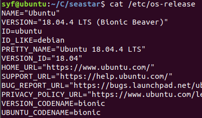

## seastar分析

### 依赖库

boost, care, cryptopp, dpdk, fmt, gmp, gnutls, hwloc, libpciaccess, lksctptools, lz4, nettle, nummactl, protobuf, ragel, xml2, xz, yaml-cpp, zlib

## 方法

### seastar
#### get()
获取当前语句的future，如果未完成则阻塞。

#### defer()

定义：

```c++
template <typename Func>
class deferred_action {
    Func _func;
    deferred_action(Func&& func) noexcept : _func(std::move(func)) {}
    ~deferred_action() { if (!_cancelled) { _func(); }; }
};
```

即，构造一个defer类，其中注册一个func，defer析构时会调用此func。

通常用来自动执行shard的stop()。

## 变量

### seastar

#### shard_id

```c++
using shard_id = unsigned;
```

## 20版本编译记录

先看一下系统版本：



其中apt源配置方法：https://blog.csdn.net/u013862444/article/details/98619724

### 1.编译过程解析

`gcc/g++  --version`：7.5.0

`make -v`：4.1

其余依赖项直接`sudo ./install-dependencies.sh`然后

```
ninja -C build/release
```
进行编译

#### （cook）

cook其实是在cooking_recipe.cmake文件中，从指定路径下载压缩包再编译。

### 2.报错

#### 2.1 fmt版本


ubuntu官方的libfmt-dev最高就支持到4.0.0。


**解决：安装fmt**

```shell
wget https://github.com/fmtlib/fmt/archive/refs/tags/7.1.0.tar.gz
tar zxvf 7.1.0.tar.gz
cd fmt-7.1.0/
mkdir build
cd build
cmake ..
make
make install
```


#### 2.2 DPDK
**报错：Could NOT find dpdk**


**解决：未影响，暂略**

#### 2.3 ‘std::experimental’问题

**报错：**

error: ‘optional’ in namespace ‘std::experimental’ does not name a template type

根源在于util/std-compat.hh采用的experimental版定义，设置宏定义即可。

**解决：**

根目录的Cmakelist中的Seastar_STD_OPTIONAL_VARIANT_STRINGVIEW设置为ON。

**注意：**

修改完要删掉build文件夹，再重新进行configure。

#### 2.4 ‘index_sequence’ is not a member of ‘std’


**报错：**

编译语句中，有-std=gnu++11，把前面的gnu++17覆盖了。

Cmakelist.txt：


