# linux

这本书用的是0.95版本，和当前版本有不同。

## 进程控制

#### linux进程状态

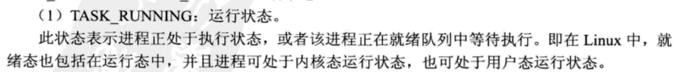

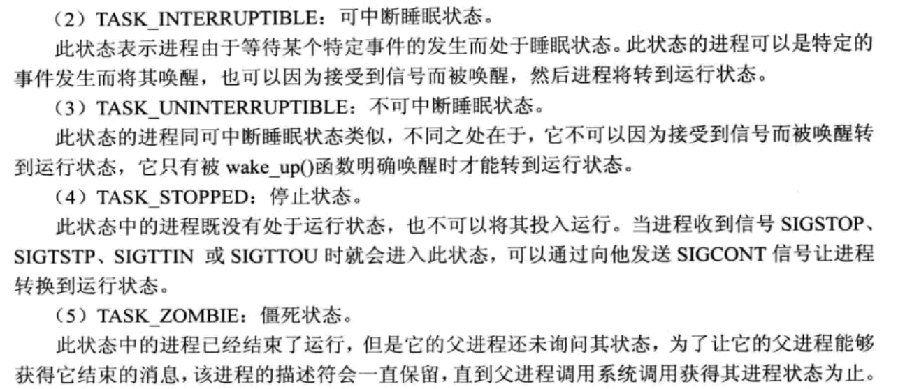

#### tast_struct

linux内核用task_struct表示一个进程，创建新进程时系统分配一个task_struct结构，然后把指针保存在task数组中。

创建新进程时，如果task数组满了，fork()系统调用会返回-1。如果创建成功，父进程中fork()返回子进程ID，子进程返回0。

当正在执行的进程时间片结束时，调度程序执行。时间片的分配是根据优先级分配的。

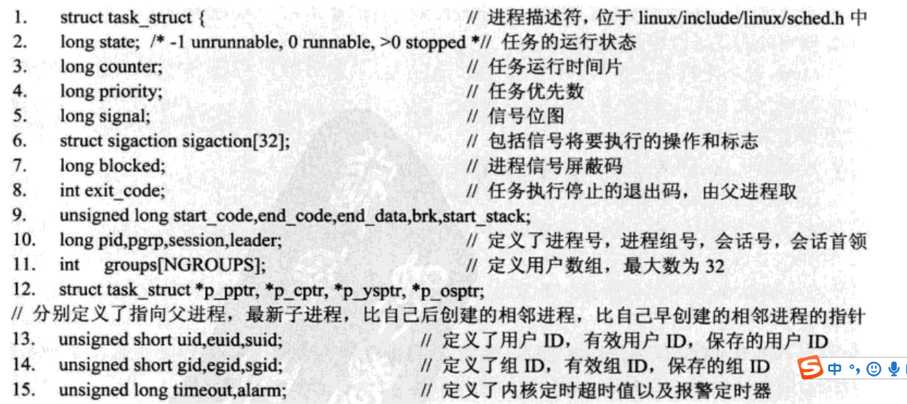

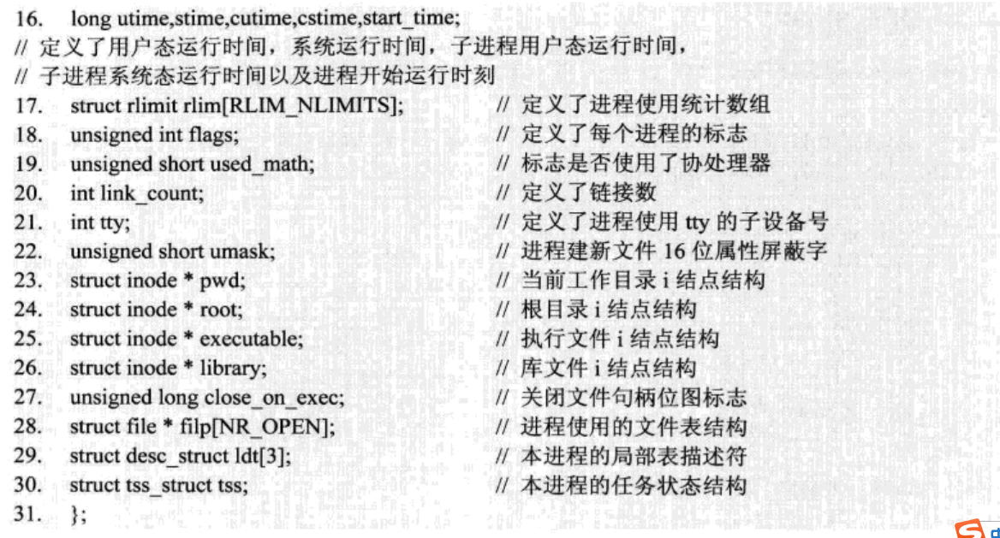

tss_struct:

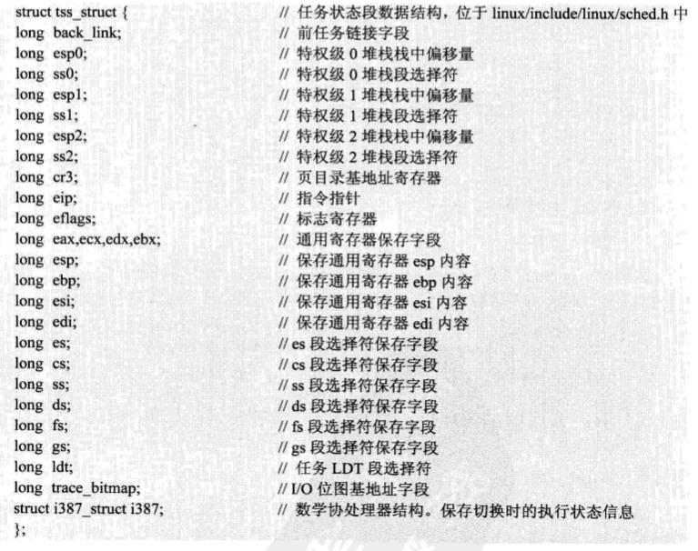

##### timeout

```c++
unsigned long timeout;//当前已使用的时间（与开始时间的差值）
```

##### counter

long counter; 
在 轮转法调度时表示进程当前还可运行多久。在进程开始运行是被赋为priority的值，以后每隔一个tick(时钟中断)递减1，减到0时引起新一轮调度。重新调度将从run_queue队列选出counter值最大的就绪进程并给予CPU使用权，因此counter起到了进程的动态优先级的作用 (priority则是静态优先级)。 

#### fork.c


#####  sys_fork()

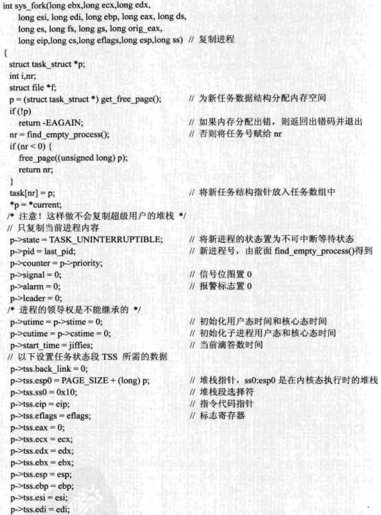
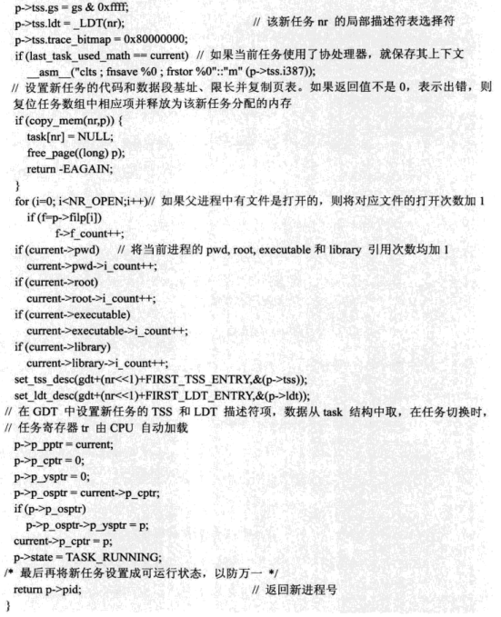

#### sched.c & 进程调度相关


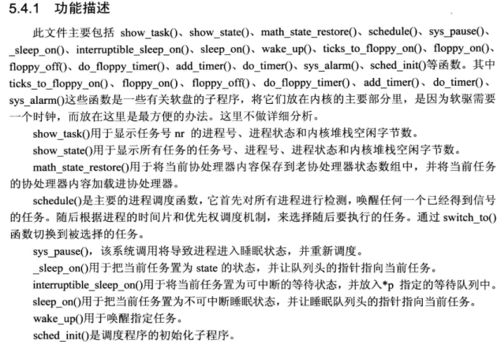

##### schedule()

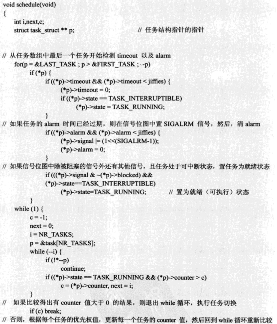

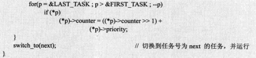

##### jiffies

是记录着从电脑开机到现在总共的时钟中断次数。在 Linux 2.6 中，系统时钟每 1 毫秒中断一次，时钟频率，用 HZ 宏表示，定义为 1000。Linux内核从2.5版内核开始把频率从100调高到1000。

##### SIGALRM

alarm系统调用的原型为：

\#include <unistd.h>

unsigned int alarm(unsigned int seconds);

**參数说明：**

1）seconds：要设定的定时时间，以秒为单位。在alarm调用成功后開始计时。超过该时间将触发SIGALRM信号。

**返回值：**

返回当前进程曾经设置的定时器剩余秒数。

```c++
void main(){
    //安装SIGALRM信号
    if(signal(SIGALRM,CbSigAlrm)==SIG_ERR){
        perror("signal");
        return;
    }
    //关闭标准输出的行缓存模式
    setbuf(stdout,NULL);
    //启动定时器
    alarm(1);
    //进程进入无限循环，仅仅能手动终止
    while(1){
    //暂停，等待信号
    pause();
    }
}
```

##### SIGCLD & 僵尸进程

在Linux的多进程编程中，SIGCLD是一个很重要的信号。当一个子进程退出时。并非马上释放其占用的资源，而是通知其父进程，由父进程进行兴许的工作。

在这一过程中，系统将依次产生下列事件。

1）向父进程发送SIGCLD信号，子进程进入zombie（僵尸）状态。

2）父进程接收到SIGCLD信号，进行处理。

​      假设在上述过程中父进程既没有忽略SIGCLD信号。也未捕获该信号进行处理，则子进程将进入僵尸状态。僵尸状态的进程不能被操作系统调用，也没有不论什么可执行代码，它只是是占用了进程列表中的一个位置而已。

​      假设仅有几个僵尸进程不会影响系统的执行，可是假设僵尸进程过多。则将会严重影响系统的执行。因此，在编程过程中应避免产生僵尸进程。有两种主要的处理方法能够避免产生僵尸进程：一是父进程忽略SIGCLD信号；二是父进程捕获SIGCLD信号，在信号处理函数中获取子进程的退出状态。忽略信号的方式比較简单。仅仅须要调用**signal(SIGCLD,SIG_IGN)**语句就可以完毕。假设要捕获信号并处理。那么先要安装SIGCLD信号，然后在信号处理函数中调用wait或者waitpid等函数获取子进程的退出状态。

#### 孤儿进程

若父进程已经退出，而子进程还在运行，那么子进程的父进程被设置为init进程（pid为1）。而init会循环wait()它的子进程，所以孤儿进程不会有什么危害。

### CFS调度

Linux对普通的进程，根据动态优先级进行调度。而动态优先级是由静态优先级（static_prio）调整而来。Linux下，静态优先级是用户不可见的，隐藏在内核中。而内核提供给用户一个可以影响静态优先级的接口，那就是nice值，两者关系如下：

　　static_prio=MAX_RT_PRIO +nice+ 20

　　nice值的范围是-20~19，因而静态优先级范围在100~139之间。nice数值越大就使得static_prio越大，最终进程优先级就越低。

### RT调度器

实时进程，只有静态优先级，范围是0~99。

### 调度时机

#### 为什么延迟调度

为什么要存在延迟调度的方式，通过设置一个TIF_NEED_RESCHED，等到中断/异常返回的时候才执行，而不是直接执行调度行为？
原因如下：
(1)唤醒操作经常在中断上下文中执行，在这个环境中直接调用schedule()进行调度是不行的；
(2)为了维护非抢占内核以来的一些传统，不要轻易中断进程的处理逻辑除非他主动放弃；
(3)在普通上下文中，唤醒后接着调用schedule()也是可以的，比如smp_send_reschedule()、resched_curr()函数就是这么实现

#### 说法1

如果Linux内核不支持抢占，那么进程要么主动要求调度，如schedule()或者cond_resched()；要么在系统调用、异常处理和中断处理完成返回用户空间前夕。

 

在支持可抢占内核中，如果唤醒动作发生在系统调用或者异常处理上下文中，在下一次调用preempt_enable()是会检查是否需要抢占调度；

中断处理返回前夕会检查是否要抢占当前进程，注意这里是中断返回而不是不支持抢占情况的用户空间返回。

#### 说法2

调度的时机
内核中常见的调度场景如下：
（1）进程被阻塞时，比如执行sleep()后，需要立刻执行schedule()进行调度
（2）当唤醒进程时，比如try_to_wake_up()执行时，会重新计算负载，查找需要执行的进程，并设置TIF_NEED_RESCHED标志延时调度
（3）当周期执行的scheduler_tick()发现需要切换进程时，设置TIF_NEED_RESCHED标志延时调度

以上的场景只是个别举例介绍，那么概括起来的话，到底在哪些时间点是内核允许调度的时机呢？
调度发生的时机有如下一些时间点：
（1）显式调用schedule()
（2）中断和异常返回到userspace时，会判断current进程的TIF_NEED_RESCHED标志，如果置位，就触发调度行为。
（3）syscall系统调用返回到userspace时，会判断current进程的TIF_NEED_RESCHED标志，如果置位，触发调度行为。
（4）如果使能了内核抢占，那么在preempt_enable()被调用是也会判断TIF_NEED_RESCHED标志并且符合规则后触发调度行为。

#### 说法3

Linux调度时机主要有：

1、进程状态转换的时刻：进程终止、进程睡眠；

2、当前进程的时间片用完时（current->counter=0）；

3、设备驱动程序

4、进程从中断、异常及系统调用返回到用户态时；

时机1，进程要调用sleep（）或exit（）等函数进行状态转换，这些函数会主动调用调度程序进行进程调度；

时机2，由于进程的时间片是由时钟中断来更新的，因此，这种情况和时机4是一样的。

时机3，当设备驱动程序执行长而重复的任务时，直接调用调度程序。在每次反复循环中，驱动程序都检查need_resched的值，如果必要，则调用调度程序schedule()主动放弃CPU。

时机4，如前所述，不管是从中断、异常还是系统调用返回，最终都调用ret_from_sys_call（），由这个函数进行调度标志的检测，如果必要，则调用调用调度程序。那么，为什么从系统调用返回时要调用调度程序呢？这当然是从效率考虑。从系统调用返回意味着要离开内核态而返回到用户态，而状态的转换要花费一定的时间，因此，在返回到用户态前，系统把在内核态该处理的事全部做完。

### 进程一定是通过RUNNING状态切换

进程创建后，状态可能发生一系列的变化，直到进程退出。而尽管进程状态有好几种，但是进程状态的变迁却只有两个方向——从TASK_RUNNING状态变为非TASK_RUNNING状态、或者从非TASK_RUNNING状态变为TASK_RUNNING状态。总之，TASK_RUNNING是必经之路，不可能两个非RUN状态直接转换。

也就是说，如果给一个TASK_INTERRUPTIBLE状态的进程发送SIGKILL信号，这个进程将先被唤醒（进入TASK_RUNNING状态），然后再响应SIGKILL信号而退出（变为TASK_DEAD状态）。并不会从TASK_INTERRUPTIBLE状态直接退出。


## 内存管理

### 缺页中断

一般进程的地址空间即逻辑地址是大于分配给它的物理地址的，那么只有部分页可以映射到页框，当请求一个逻辑地址时，先查看当前进程的页表，如果有该页的页表项，那么说明它已经被映射到页框，返回对应的物理地址即可，否则说明要请求的页面不在内存中，引发缺页中断，置换出一个内存中的页，然后再把请求的页调入内存。


简述异常处理过程
1. 判断是否在原子操作时出现异常  是 return0
2. 判断是否是内核线程（mm_struct ==NULL）如果是进入内核异常处理，通过遍历异常链表试图修正，如果无法通过调试则打印后退出。
3. 查找后面最近的虚拟地址空间（VMA），如果没有则地址错误，发送信号杀掉进程。
4. 如果有，判断后面找到的VMA是否为栈（栈可以增长），如果是进入异常错误处理，不是发送信号后杀掉进程。
5. 判断是否是权限错误
6. 进行异常处理

先确定线性地址对应的目录项是否存在，如果不存在为引发缺页的进程分配一个物理页框。

被访问的页框在主存中，（写时拷贝）将存在的只读页复制到新页框中。fork（）后给子进程分配零页，只可以读。

进行写操作时被访问的页框不在主存中，分配页框，分为线性映射，非线性映射，swap映射。malloc后第一次访问该页。

释放信号量，返回0，异常处理完毕。

### 一、缺页中断处理函数do_page_fault()

先判断if (in_atomic() || !mm)，看是否发生在内核。
#### 内核空间的缺页中断
若发生在内核，调用`_do_kernel_fault()`尝试解决。若无法解决说明内核设计有问题，`do_exit(SIGKIL)`
#### 用户空间的缺页中断
若发生在内核，调用`_do_page_fault()`

### 二、_do_page_fault()
#### 1.异常判断

1、导致缺页异常的线性地址根本不在进程的“虚存区间”中，段错误。（栈扩展是一种例外情况）
2、地址在“虚存区间”中，但“虚存区间”的访问权限不够；例如“区间”是只读的，而你想写，段错误
3、……

#### 2.若不是异常情况，`handle_mm_fault()`
```
int handle_mm_fault(){
    // 先判断各种异常，然后：↓
    pte = pte_alloc_map(...);
    handle_pte_fault(..., pte, ...);
}
```
### 三、`handle_pte_fault()`
首先判断 `if (!pte_present(entry))`

#### 1. 未映射物理页，L_PTE_PRESENT = 0
如果这个二级页表条目的值为0，即什么都没有，那么说明这个地址所在的vma是完完全全没有做过映射物理页的操作。

##### 1.1 if (pte_none(entry)) 

###### 1.1.1 if (vma->vm_ops)  且 if (likely(vma->vm_ops->fault))：文件映射

根据该vma是否存在vm_ops成员即操作函数，并且vm_ops存在fault成员，这说明是文件映射而非匿名映射文件映射，执行`do_linear_fault()`

###### 1.1.2 其他：匿名映射

否则就是匿名映射，执行`do_anonymous_page()`

事实上日常使用的malloc都是匿名映射。匿名映射体现了linux为进程分配物理空间的基本态度，不到实在不行的时候不分配物理页，当使用malloc/mmap申请映射一段物理空间时，内核只是给该进程创建了段线性区vma，但并未映射物理页，然后如果试图去读这段申请的进程空间，由于未创建相应的二级页表映射条目，MMU会发出缺页异常，而这时内核依然只是把一个默认的零页zero_pfn(这是在初始化时创建的，前面的内存页表的文章描述过)给vma映射过去，当应用程序又试图写这段申请的物理空间时，这就是实在不行的时候了，内核才会给vma映射物理页。


##### 1.2 `if (pte_file(entry))`

仍然在请求调页的情况下，如果二级页表条目的值含有L_PTE_FILE标志，说明这是个非线性文件映射，执行`do_nonlinear_fault()`

##### 1.3 其他

其他情况视为物理页曾被分配过，但后来被linux交换出内存，将调用函数`do_swap_page`再分配物理页。


#### 2. 已映射物理页，L_PTE_PRESENT = 1
它的异常addr的二级页表条目还是存在的(就是说起码存在标志L_PTE_PRESENT)，只是说映射的物理页不可写。有两种情况：

一种是之前给vma映射的是零页(zero_pfn)
另外一种是访问fork得到的进程空间(子进程与父进程共享父进程的只读页)    

共同特点就是: 二级页表条目不允许写，简单说就是该页不可写。

###### 执行 `do_wp_page()`

## SOCKET

### epoll
#### select原理

```c++
int s = socket(AF_INET, SOCK_STREAM, 0);  
bind(s, ...)
listen(s, ...)

int fds[] =  //存放需要监听的socket

while(1){
    int n = select(..., fds, ...) //在这里阻塞了
    for(int i=0; i < fds.count; i++){
        if(FD_ISSET(fds[i], ...)){
            //fds[i]的数据处理
        }
    }
}
```


select的实现思路很直接。假如程序同时监视如下图的sock1、sock2和sock3三个socket，那么在调用select之后，操作系统把进程A分别加入这三个socket的等待队列中。别加入这三个socket的等待队列中。

当任何一个socket收到数据后，中断程序将唤起进程。下图展示了sock2接收到了数据的处理流程。
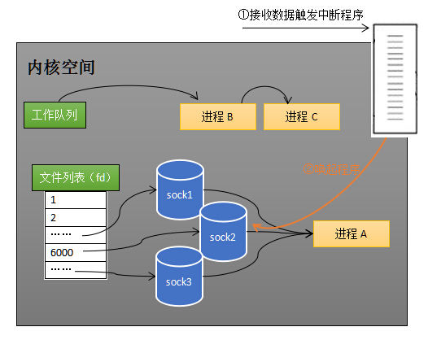

所谓唤起进程，就是将进程从所有的等待队列中移除，加入到工作队列里面。
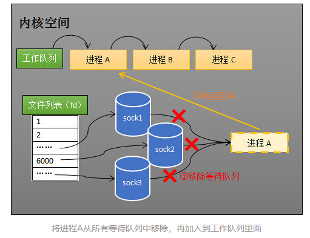


#### select 和 poll 的缺点
一，用户需要将监控的文件描述符集合打包当做参数传入，每次调用时，这个集合都会从用户空间拷贝到内核空间。
二，每次调用select都需要将进程加入到所有监视socket的等待队列，每次唤醒都需要从每个队列中移除。进程被唤醒后，程序并不知道哪些socket收到数据，还需要遍历一次。

#### epoll改进

**措施一：功能分离**

select低效的原因之一是将“维护等待队列”和“阻塞进程”两个步骤合二为一。如下图所示，每次调用select都需要这两步操作，然而大多数应用场景中，需要监视的socket相对固定，并不需要每次都修改。epoll将这两个操作分开，先用epoll_ctl维护等待队列，再调用epoll_wait阻塞进程。显而易见的，效率就能得到提升。

**措施二：就绪列表**

select低效的另一个原因在于程序不知道哪些socket收到数据，只能一个个遍历。如果内核维护一个“就绪列表”，引用收到数据的socket，就能避免遍历。如下图所示，计算机共有三个socket，收到数据的sock2和sock3被rdlist（就绪列表）所引用。当进程被唤醒后，只要获取rdlist的内容，就能够知道哪些socket收到数据。

#### epoll用法
```
int s = socket(AF_INET, SOCK_STREAM, 0);   
bind(s, ...)
listen(s, ...)

int epfd = epoll_create(...);
epoll_ctl(epfd, ...); //将所有需要监听的socket添加到epfd中

while(1){
    int n = epoll_wait(...)
    for(接收到数据的socket){
        //处理
    }
}
```
#### epoll数据结构
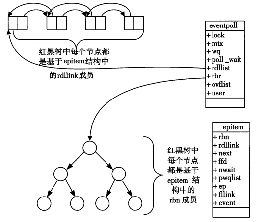

当调用epoll_wait检查是否有事件发生时，只需要检查eventpoll对象中的rdlist双链表中是否有epitem元素即可。

#### 工作模式

　epoll对文件描述符的操作有两种模式：LT（level trigger）和ET（edge trigger）。LT模式是默认模式，LT模式与ET模式的区别如下：

 LT模式：当epoll_wait检测到描述符事件发生并将此事件通知应用程序，应用程序可以不立即处理该事件。下次调用epoll_wait时，会再次响应应用程序并通知此事件。　　

 ET模式：当epoll_wait检测到描述符事件发生并将此事件通知应用程序，应用程序必须立即处理该事件。如果不处理，下次调用epoll_wait时，不会再次响应应用程序并通知此事件。　　

 ET模式在很大程度上减少了epoll事件被重复触发的次数，因此效率要比LT模式高。epoll工作在ET模式的时候，必须使用非阻塞套接口，以避免由于一个文件句柄的阻塞读/阻塞写操作把处理多个文件描述符的任务饿死。


## 引用

1. https://blog.csdn.net/Paranoid_cc/article/details/79463717
2. https://www.jianshu.com/p/691d02380312
3. https://www.cnblogs.com/yxysuanfa/p/6782474.html
4. https://blog.csdn.net/u010246947/article/details/10431149
5. https://blog.csdn.net/rikeyone/article/details/87691208
6. https://www.cnblogs.com/skying555/p/5029620.html